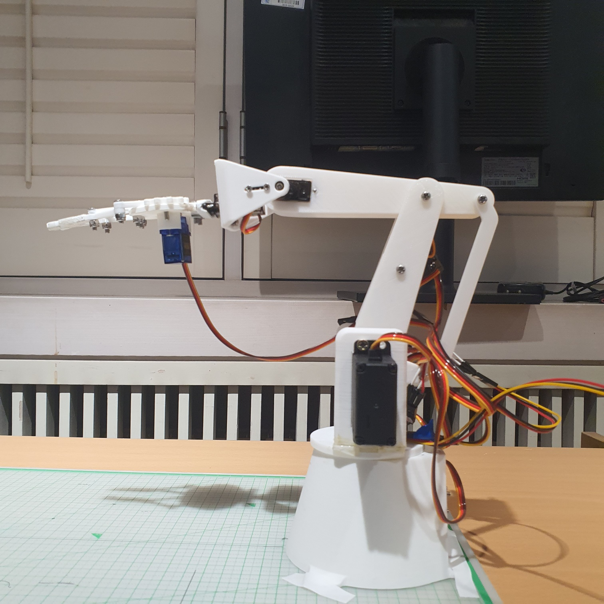

# Robotic Arm for Electronic Component Sorting(on Jetson Nano)

## 한양대학교 융합전자공학부 인공지능플랫폼기초및실습(최정욱 교수님) 프로젝트

## 작성자: Team Park (Team3 - 박성호, 박태건)

본 레포지토리는 TRT변환 및 engine을 활용한 추론을 위해 [`triple-Mu/YOLOv8-TensorRT`](https://github.com/triple-Mu/YOLOv8-TensorRT)레포지토리를 fork했음을 밝힙니다.

---

# 참고 문서

## TRT 변환 및 engine 활용 추론

github>[`triple-Mu/YOLOv8-TensorRT`](https://github.com/triple-Mu/YOLOv8-TensorRT)

## 로봇팔 설계 및 역기구학 동작

thingiverse>[`isaac879/3D printed 5-axis Robot Arm (Servo Driven)`](https://www.thingiverse.com/thing:2703913)

## Img2World 좌표 변환을 위한 클릭 기반 좌표 수집 및 Calibration

github>[`Ryoyo-NV/People-Flow-Analysis-System`](https://github.com/Ryoyo-NV/People-Flow-Analysis-System)

---

# 로봇팔 실행 방법

 

로봇팔은 yaw, shoulder, elbow, wrist, wrist_rotation, gripper에 대한 총 6개의 서보모터로 동작합니다.

## 하드웨어 연결

로봇팔을 작동시키기 위해 PCA9685(서보모터 드라이버)의 채널 0~5에 yaw, shoulder, elbow, wrist, wrist_rotation, gripper 의 서보모터를 순서대로 연결합니다.
jetson nano와 서보모터 드라이버를 연결합니다.(3.3V 전원, bus1(SDA, SCL), GND 사용 --> Jetson Nano의 1,3,5,6번 핀)
서보모터 드라이버에 모터 동작 전원을 위해 5V 6A 어댑터를 연결합니다.(모든 GND는 breadboard를 이용해 통합했습니다.)

## 로봇팔 동작시키기

하드웨어가 연결된 상태에서 이 레포지토리를 다운로드하여 Jetson Nano 터미널에서 다음 명령어를 실행합니다.

```shell
python3 robot_arm_main.py
```

본 프로젝트에 사용된 라이브러리는 모두 pip 설치가 가능합니다. 실행 시 설치되지 않은 라이브러리가 있다면 pip 설치 후 실행 가능합니다.
해당 파일은 동일 디렉토리 내 detector, calibration 모듈 등을 활용하여 실행됩니다.

실행 시 로봇팔은 웹캠 입력을 받아와 회로 소자를 탐지하고 grip & lay down을 반복합니다.
웹캠 입력에서 객체가 감지되지 않을 경우 종료됩니다.

본 프로젝트는 Jetson Nano의 기본 Jetpack 버전에서 시뮬레이션 되었습니다. (Python 3.6.9, TensorRT 8.2.1)

감사합니다.
